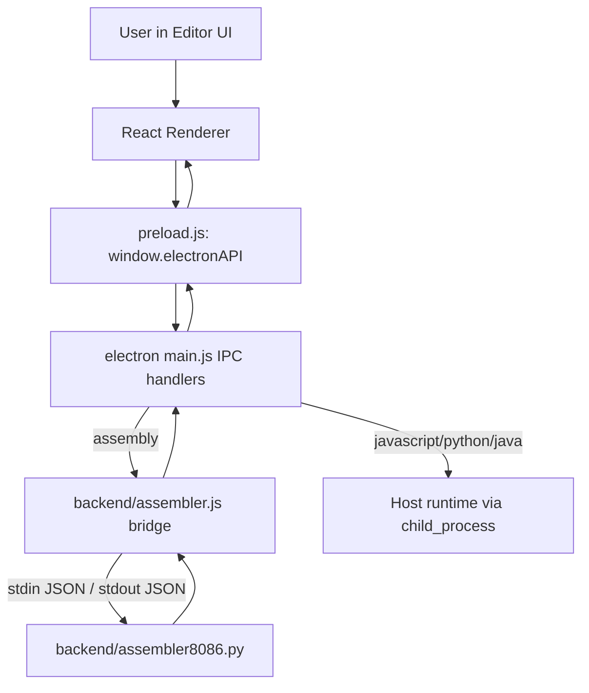
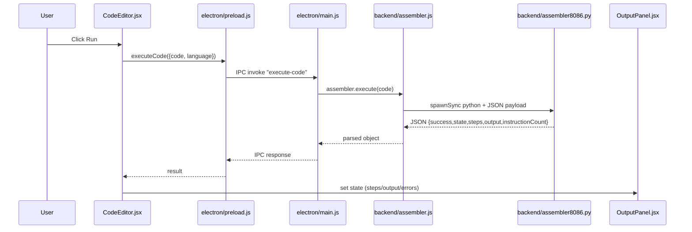

# Opsis Complete Project Context (Handoff)

This document is a one-file handoff for another GPT/engineer to understand how this project works without opening files one-by-one.

## 1) What This App Is

`Opsis` is an Electron desktop code editor with a VS Code-like UI.  
Its core value is an assembly execution experience:

- Write assembly in Monaco editor
- Run and simulate instruction-by-instruction
- Inspect registers, flags, memory, and output timeline

It also supports non-assembly execution (JavaScript/Python/Java) through the Electron main process.

## 2) Tech Stack

| Layer | Technology | Notes |
|---|---|---|
| Desktop shell | Electron | Main process + preload bridge |
| UI | React 19 + Vite 7 | Renderer app |
| Editor | Monaco (`@monaco-editor/react`) | Custom assembly syntax tokens |
| Assembler bridge | Node (CommonJS) | Spawns Python process |
| Assembler engine | Python (`assembler8086.py`) | Parses + executes ASM |
| Build | `vite-plugin-electron`, `electron-builder` | Desktop packaging config present |
| Styling | CSS + Tokyo Night theme | Componentized CSS files |

## 3) High-Level Runtime Architecture



## 4) End-to-End Assembly Execution Flow



## 5) Complete Source Tree (project files)

Below is the practical project tree for handoff (source/docs/config).  
Large dependency folders (like `node_modules`) are intentionally omitted.

```text
opsis/
├── .gitignore
├── package-lock.json
├── structure.txt
├── context.md
├── backend/
│   ├── README.md
│   ├── QUICK_REFERENCE.md
│   ├── LEXER_GUIDE.md
│   ├── assembler.js
│   ├── assembler8086.py
│   ├── ipc-handlers.js
│   ├── lexer.js
│   ├── parser.js
│   ├── lexer-test.js
│   ├── parser-test.js
│   ├── test-mov.js
│   ├── test-mul-div.js
│   ├── test-dual-arch.js
│   ├── integration-example.js
│   └── debug-number.js
└── frontend/
    ├── package.json
    ├── package-lock.json
    └── my-app/
        ├── .gitignore
        ├── README.md
        ├── README_OPSIS.md
        ├── QUICK_START.md
        ├── PROJECT_SUMMARY.md
        ├── UI_DESIGN_DOC.md
        ├── NEW_UI_README.md
        ├── BUILD_DEPLOY_GUIDE.md
        ├── package.json
        ├── package-lock.json
        ├── eslint.config.js
        ├── vite.config.js
        ├── index.html
        ├── start.bat
        ├── sample-code.js
        ├── sample-code.py
        ├── public/
        │   └── examples.asm
        ├── electron/
        │   ├── main.js
        │   └── preload.js
        ├── dist-electron/
        │   ├── main.js
        │   └── preload.js
        └── src/
            ├── main.jsx
            ├── App.jsx
            ├── App.css
            ├── index.css
            ├── theme/
            │   └── tokyoNight.css
            ├── styles/
            │   ├── OutputPanel.css
            │   ├── RegisterPanel.css
            │   └── MemoryViewer.css
            └── components/
                ├── CodeEditor.jsx
                ├── CodeEditor.css
                ├── OutputPanel.jsx
                ├── MenuBar.jsx
                ├── MenuBar.css
                ├── Sidebar.jsx
                ├── Sidebar.css
                ├── FileExplorer.jsx
                ├── FileExplorer.css
                ├── FileTabs.jsx
                ├── FileTabs.css
                ├── BottomPanel.jsx
                ├── BottomPanel.css
                ├── RegisterPanel.jsx
                ├── StatusBar.jsx
                ├── StatusBar.css
                ├── MemoryViewer.jsx
                ├── LoadingScreen.jsx
                └── LoadingScreen.css
```

## 6) Responsibilities by Important File

### Root
- `structure.txt`: historical tree dump (includes huge dependency paths).
- `context.md`: this handoff file.

### Backend (`backend/`)
- `assembler.js`: Node bridge class (`Assembler8086Bridge`), manages state and calls Python through `spawnSync`.
- `assembler8086.py`: actual interpreter/simulator, parses assembly, executes loop, tracks steps/output/registers/flags/memory.
- `lexer.js`: custom lexer for assembly tokenization (not primary runtime path).
- `parser.js`: token parser to instruction model (not primary runtime path).
- `ipc-handlers.js`: alternate IPC wiring helper (not the active path used by current Electron main file).
- `README.md` / `QUICK_REFERENCE.md` / `LEXER_GUIDE.md`: backend docs and instruction references.
- `*-test.js`: manual or script tests for parser/lexer/ops.

### Frontend app (`frontend/my-app/`)
- `electron/main.js`: creates window, sets CSP, file dialog IPC, `execute-code` handler, non-assembly runtime commands.
- `electron/preload.js`: exposes limited safe API to renderer (`openFile`, `saveFile`, `saveFileAs`, `executeCode`).
- `src/App.jsx`: loading gate then `CodeEditor`.
- `src/components/CodeEditor.jsx`: central editor state and run pipeline.
- `src/components/OutputPanel.jsx`: execution timeline, step details, output, register/flag/pointer visualization.
- `src/styles/OutputPanel.css`: execution panel layout/visual styling.
- `src/components/RegisterPanel.jsx`, `src/components/MemoryViewer.jsx`: standalone viewers (main flow currently uses `OutputPanel` integrated sidebar).
- `src/components/MenuBar.jsx`, `FileExplorer.jsx`, `FileTabs.jsx`, `StatusBar.jsx`, `Sidebar.jsx`: shell/workbench UX.
- `vite.config.js`: Vite + Electron plugin integration and build outputs.
- `package.json`: scripts and desktop build metadata.

## 7) Data Models Returned by Assembler

Typical assembly execution response from Python:

- `success: boolean`
- `state`
  - `registers`: includes 8086 (`AX BX CX DX SI DI BP SP IP`) plus compatibility registers (`A B C D E H L M`)
  - `flags`: `Z C S P O`
  - `memory`: array (size 65536)
  - `pc`, `sp`
- `steps[]`: each instruction snapshot with:
  - `pc`
  - `instruction`
  - `before` state
  - `after` state
  - `output` (if emitted)
- `output[]`: OUT values with decimal/hex/binary
- `instructionCount`

On error:
- `success: false`
- `error`
- `errorDetails: { line, pc, instruction }`
- partial `steps` and `state`

## 8) UI Composition and Behavior

Top-level layout in `CodeEditor.jsx`:

1. Menu bar (`MenuBar`)
2. Left side activity + explorer (`Sidebar`, `FileExplorer`)
3. File tabs (`FileTabs`)
4. Monaco code editor
5. Resizable assembly output area (`OutputPanel`)
6. Status bar (`StatusBar`)

Execution behavior:

- Run starts with loading text and resets previous trace state.
- Successful run updates:
  - `assemblerState`
  - `executionSteps`
  - `executionOutput`
  - `instructionCount`
- Failed run sets formatted error and highlights failing line in Monaco.

## 9) IPC Contract (Current Reality)

### Exposed to renderer via preload (usable directly)
- `openFile()`
- `saveFile(data)`
- `saveFileAs(data)`
- `executeCode(data)`

### Registered in main process but not exposed in preload
- `assembler:reset`
- `assembler:getState`
- `assembler:setRegister`
- `assembler:getMemory`
- `assembler:setMemory`

Implication: renderer currently uses mostly `execute-code` and file operations.

## 10) Assembly Instruction Support (Engine)

The Python engine supports at least:

- Data: `MOV`, `MVI`, `LDA`, `STA`
- Arithmetic: `ADD`, `SUB`, `MUL`, `DIV`, `INC`, `DEC`
- Compare/control: `CMP`, `JMP`, `JZ`, `JNZ`
- Output/control: `OUT`, `HLT`, `INT`, `NOP`

Number formats supported:
- Hex: `0xFF`, `FFH`
- Binary: `0b1010`, `1010B`
- Decimal: `42`

## 11) Non-Assembly Execution Path

Inside `electron/main.js`, `execute-code` also supports:

- JavaScript -> writes temp `.js`, runs `node`
- Python -> writes temp `.py`, runs `python`
- Java -> writes temp `.java`, runs `javac` and then `java`

This is separate from the assembly interpreter path.

## 12) Build and Run

From `frontend/my-app`:

- `npm run dev` -> Vite renderer
- `npm run electron:start` -> launch Electron shell
- `npm run electron:dev` -> Vite electron mode
- `npm run build` / `npm run electron:build` -> package via `electron-builder`

Requirements:
- Node/npm
- Python available on PATH (for assembly engine)
- Java runtime/toolchain if using Java execution

## 13) Known Gaps / Drift / Risks

1. IPC surface mismatch: assembler channels exist in main but are not bridged in preload.
2. Two parsing stacks: JS lexer/parser exist, but runtime execution primarily uses Python parser.
3. Naming inconsistency: `Assembler8085` variable points to `assembler.js` bridge class for 8086 + compatibility.
4. Some UI components are partially wired/legacy (`BottomPanel` imported but not the main execution panel path).
5. Docs and implementation may diverge in places (feature mentions vs current active UI behavior).

## 14) Quick Mental Model For New GPT

If you need to change behavior, start here:

1. UI/interaction change -> `frontend/my-app/src/components/CodeEditor.jsx` and `OutputPanel.jsx` + CSS.
2. IPC or file/runtime behavior -> `frontend/my-app/electron/main.js` and `preload.js`.
3. Assembly semantics -> `backend/assembler8086.py`.
4. Bridge/state serialization issues -> `backend/assembler.js`.

This gives the fastest path to productive edits.
